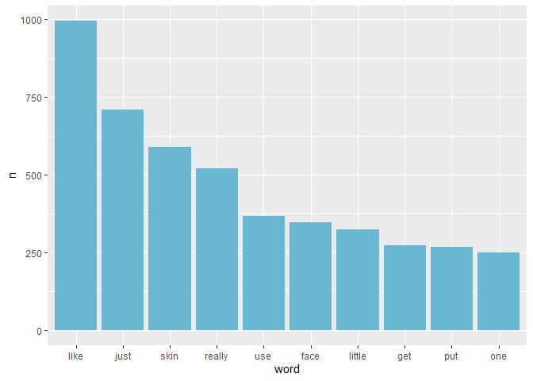

Build word embeddings in R with YouTube transcripts
================
01-22-2021

## Introduction

Last year I had a bit of a skin care phase and watched quite a few skin
care routines on YouTube. I noticed that the *Go To Bed With Me* series
by Harper’s Bazaar had auto-generated English transcripts and thought
“hey, that’s text! I can do cool NLP things with that!”.

In this post I’ll be building my own word vectors just with some
counting and matrix algebra. My aim here is to see whether a more basic
word embedding, trained on a fairly small corpus, can pick up on
semantic similarities between words. [This
article](https://www.kdnuggets.com/2019/02/word-embeddings-nlp-applications.html)
gives a good introduction to how word vectors are built with deep
learning.

Once again, I’ve taken inspiration (and code) from [Julia
Silge](https://juliasilge.com/blog/tidy-word-vectors/) whose blog post
builds on this blog post by [Chris
Moody](https://multithreaded.stitchfix.com/blog/2017/10/18/stop-using-word2vec/).
I’ll be running through the word vector method fairly quickly, so do
check out these links if you want a more in-depth look at this topic.

## Get the data

Each transcript is stored as a separate text file (I’ll publish this
somewhere more useful, one day…) with each file named after the
celebrity featured in the video. You can see how I used the **purrr**
function *map\_chr* to read the data in as a text vector:

``` r
library(here)
library(tidyverse)
library(tidytext)
library(glue)

# Get vector of file names
person <- list.files(here("skincare_transcripts")) %>%
    str_remove_all(".txt") %>%
    str_replace_all("_", " ")

# Extract text as character vector
routine_text <- list.files(here("skincare_transcripts"), full.names = T) %>%
    map_chr(read_file) %>%
    str_replace_all("\\r", " ") %>%
    str_replace_all("\\n", " ") %>%
    str_replace_all("- ", "")

# Convert to a tibble for analysis
routine_df <- tibble(
    person = person,
    text = routine_text
)
```

## Some quick data checks

Let’s take a look at the first twenty words in each of the first five
transcripts.

``` r
routine_df %>%
  head(5) %>%
  str_glue_data("{person}: {word(text, 1, 20)}")
```

    ## alissa ashley: hey guys welcome back to i'm so used to  saying my channel  hey you guys my name is
    ## anastasia soare: (bell dings)  Well, let's go to bed with me.  (upbeat music)  Before I go to bed, I
    ## antoni porowski: (upbeat music)  Hey guys.  Come get ready for bed with me.  My first step during nights on
    ## ashley graham: (phone keys typing)  Okay, it's time to get unready with me.  (upbeat music)  Today I am taking
    ## barbara palvin: (popping)  (bell dings)  Hey.  Come on in.  Let's get ready for bed.  Well hello. Welcome

Looks like some sound effects made their way into the transcripts! Time
to remove them all with some regex.

``` r
routine_df <- routine_df %>%
  mutate(
    text = str_remove_all(text, "\\s*\\([^\\)]+\\)")
  )

routine_df %>%
  head(5) %>%
  str_glue_data("{person}: {word(text, 1, 20)}")
```

    ## alissa ashley: hey guys welcome back to i'm so used to  saying my channel  hey you guys my name is
    ## anastasia soare:   Well, let's go to bed with me.  Before I go to bed, I have to take off
    ## antoni porowski:   Hey guys.  Come get ready for bed with me.  My first step during nights on weeks
    ## ashley graham:   Okay, it's time to get unready with me.  Today I am taking off my makeup for you,
    ## barbara palvin:   Hey.  Come on in.  Let's get ready for bed.  Well hello. Welcome to my bathroom.

Much better! Let’s also take a look at the most frequently used words.

``` r
tidy_routine <- routine_df %>%
    unnest_tokens(word, text) %>%
    anti_join(get_stopwords())

top_words <- tidy_routine %>%
    count(word) %>%
    top_n(10, wt = n) %>%
    ungroup() %>%
    mutate(word = fct_reorder(word, n, .desc = T))

top_words %>%
    ggplot(aes(x = word, y = n)) +
    geom_col(show.legend = F, fill = "#68B8D4") 
```

<!-- -->

That’s interesting - let’s look at how “like” is being used in these
transcripts. I’ll split each transcript into collections of 10 words,
and look for the word “like”.

``` r
set.seed(123)

split_text <- routine_df %>%
    unnest_tokens(word, text) %>%
    group_by(person, observation = row_number() %/% 10) %>%
    summarise(sentence = str_c(word, collapse = " ")) %>%
    ungroup()

split_text %>%
  select(sentence) %>%
  filter(str_detect(sentence, "like")) %>%
  slice_sample(n = 10) %>%
  pull(sentence)
```

    ##  [1] "you immediately feel your skin hydrated i feel like i"    
    ##  [2] "i apply my skincare routine like but no it's like"        
    ##  [3] "can be like a moment for my skin to just"                 
    ##  [4] "beauty products and stuff like that it's kind of like"    
    ##  [5] "a sec it looks like you like murdered someone and"        
    ##  [6] "i actually really really like remember rinse it off so"   
    ##  [7] "kinda like a primer for your facial cream super easy"     
    ##  [8] "give it a little bit of like a lift at"                   
    ##  [9] "extra added care that like maybe i'm not capable of"      
    ## [10] "a different thing depending on the blemish but first like"

It seems that “like” is being used in a lot of different ways, including
as a sentence filler (like the word “um”). There’s clearly going to be a
lot of noise in this data, but hopefully there will be some signal too!
🤞

## Build some word embeddings

### Word co-occurence probabilities

To build some word vectors, I’ll start by getting the probability of
each word occurring in the corpus.

``` r
unigram_probs <- tidy_routine %>%
    count(word, sort = T) %>%
    mutate(p = n / sum(n))
```

The next step is to determine the probability of words co-occurring,
based on a sliding window. I’ll set the size of the window to 5 for now.
Once I’ve done this, I’ll normalise the probabilities of words
co-occurring by dividing the probability of co-occurrence by the
probability of each word (p of co-occurrence / probability of word 1 /
probability of word 2). Values above1 suggest that the words are more
likely to be associated with each other.

``` r
library(widyr)

routine_skipgrams <- routine_df %>%
    unnest_tokens(ngram, text, token = "ngrams", n = 5) %>%
    mutate(ngramID = row_number()) %>%
    unite(skipgramID, person, ngramID) %>%
    unnest_tokens(word, ngram)

skipgram_probs <- routine_skipgrams %>%
    pairwise_count(word, skipgramID, diag = TRUE, sort = TRUE) %>%
    mutate(p = n / sum(n))

normalized_prob <- skipgram_probs %>%
    filter(n > 10) %>%
    rename(word1 = item1, word2 = item2) %>%
    left_join(unigram_probs %>%
                  select(word1 = word, p1 = p),
              by = "word1") %>%
    left_join(unigram_probs %>%
                  select(word2 = word, p2 = p),
              by = "word2") %>%
    mutate(p_together = p / p1 / p2)
```

### Matrix factorisation

Now for the word embeddings! First I’ll cast the normalised
probabilities to a sparse matrix - this is the matrix I’ll perform
Singular Value Decomposition (SVD) on to get the word embeddings. Before
running SVD, I’ll set all NAs in the matrix to 0.

``` r
pmi_matrix <- normalized_prob %>%
    mutate(pmi = log10(p_together)) %>%
    cast_sparse(word1, word2, pmi)

pmi_matrix@x[is.na(pmi_matrix@x)] <- 0
```

Now I’ll implement SVD on the sparse matrix. I’ve chosen a word
embedding with 30 dimensions, but this could be higher.

``` r
library(irlba)

pmi_svd <- irlba(pmi_matrix, 30, maxit = 1e3)

word_vectors <- pmi_svd$u

rownames(word_vectors) <- rownames(pmi_matrix)
```

## Look for semantically similar words

Now that the word vectors are ready, I can look for semantically similar
words based on a keyword. As this is a corpus all about skin care, let’s
try words like “skin”, “cream”, and “dry”.

``` r
library(broom)

search_similar <- function(word_vectors, selected_vector) {
    
    similarities <- word_vectors %*% selected_vector %>%
        tidy() %>%
        as_tibble() %>%
        rename(token = .rownames,
               similarity = unrowname.x.)
    
    similarities %>%
        arrange(-similarity) %>%
        head(5)
}

search_similar(word_vectors, word_vectors["skin",])
```

    ## # A tibble: 5 x 2
    ##   token  similarity
    ##   <chr>       <dbl>
    ## 1 skin        0.482
    ## 2 just        0.141
    ## 3 really      0.136
    ## 4 dead        0.126
    ## 5 cells       0.116

``` r
search_similar(word_vectors, word_vectors["cream",])
```

    ## # A tibble: 5 x 2
    ##   token    similarity
    ##   <chr>         <dbl>
    ## 1 skin         0.0751
    ## 2 makeup       0.0447
    ## 3 eye          0.0403
    ## 4 cream        0.0402
    ## 5 skincare     0.0400

``` r
search_similar(word_vectors, word_vectors["dry",])
```

    ## # A tibble: 5 x 2
    ##   token  similarity
    ##   <chr>       <dbl>
    ## 1 water      0.0361
    ## 2 makeup     0.0345
    ## 3 skin       0.0318
    ## 4 go         0.0215
    ## 5 eye        0.0197

## Conclusion

It looks like these embeddings have picked up some meaningful
similarities! 😊. Admittedly they’re not perfect, but for such a small
corpus I think this worked well.
